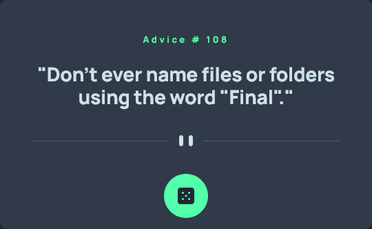

# Advice generator

This is a solution to the [Advice generator app challenge on Frontend Mentor](https://www.frontendmentor.io/challenges/advice-generator-app-QdUG-13db).

## Table of contents

  - [Overview](#overview)
  - [The challenge](#the-challenge)
  - [Screenshot](#screenshot)
  - [Links](#links)
  - [Built with](#built-with)
  - [Author](#author)

## Overview

### The challenge

Users should be able to:

- View the optimal layout for the app depending on their device's screen size
- See hover states for all interactive elements on the page
- Generate a new piece of advice by clicking the dice icon

### Screenshot

### Links

- Live Site URL: [https://j-phillips-git.github.io/fem-advice-generator/]

### Built with

- HTML5
- CSS
- JavaScript
- [Advice Slip API](https://api.adviceslip.com/)

## Author

- LinkedIn - [https://www.linkedin.com/in/jordan-phillips-/]
- Frontend Mentor - [https://www.frontendmentor.io/profile/JordanPhillips-hub]
